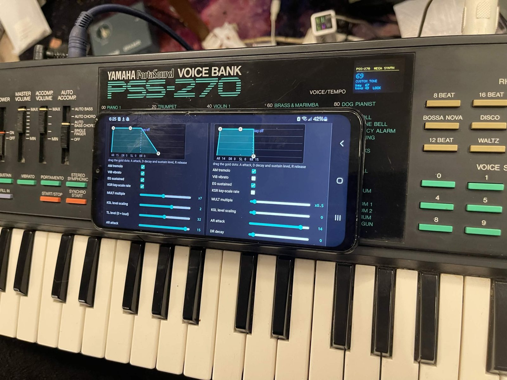
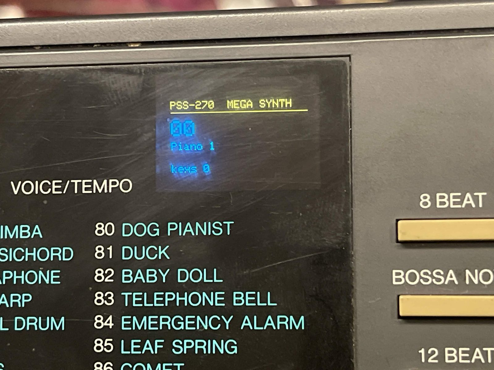
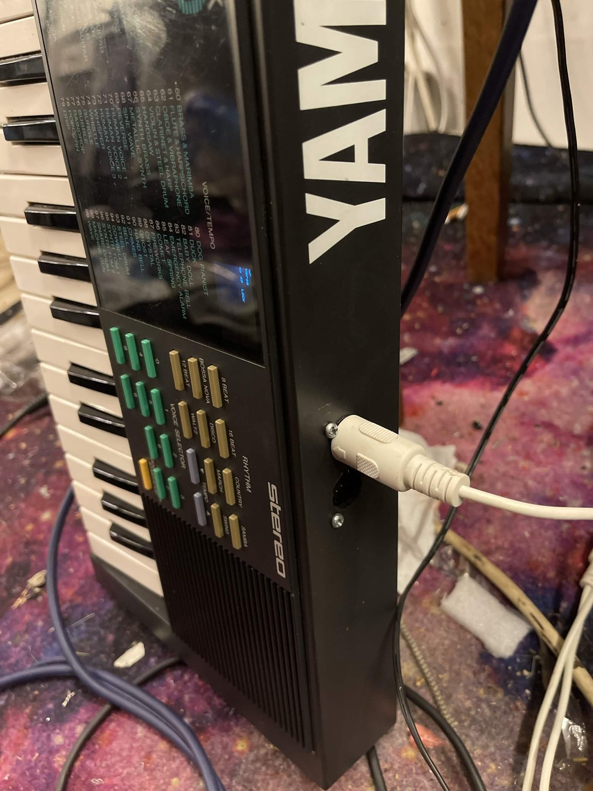
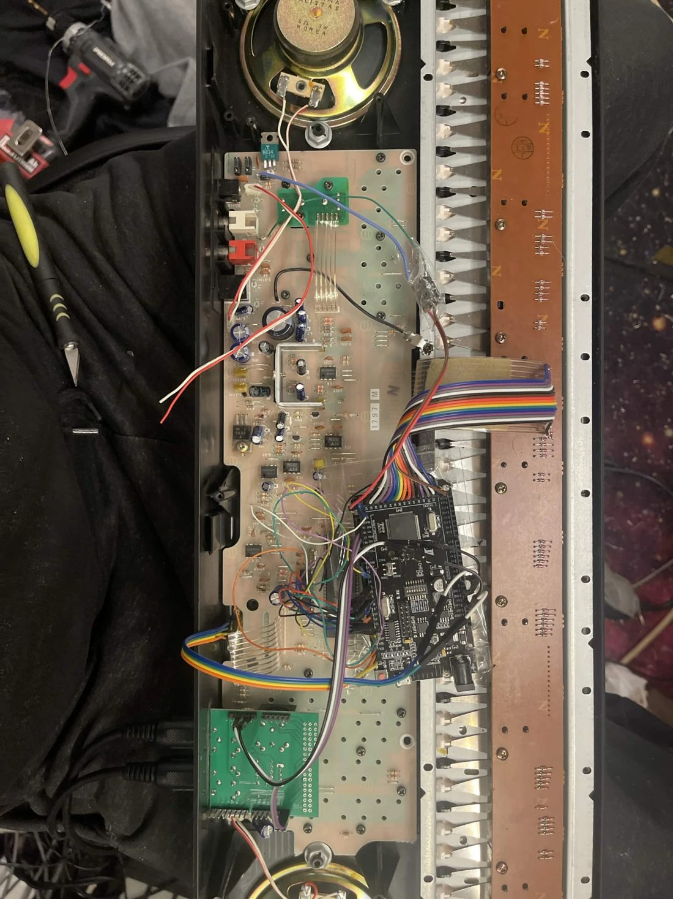
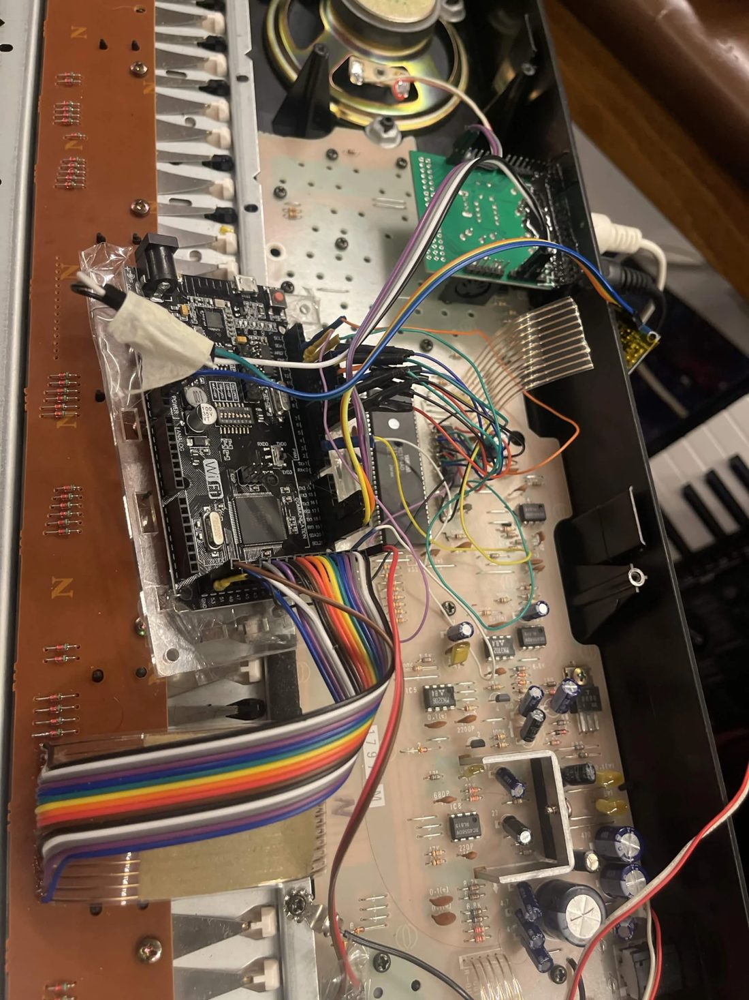
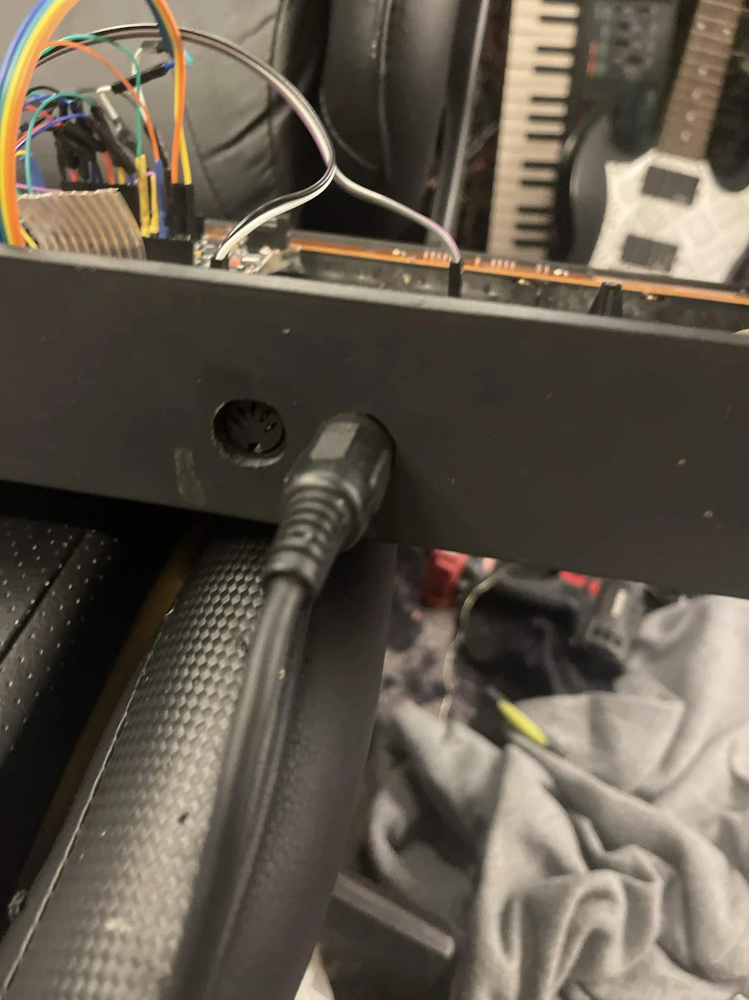
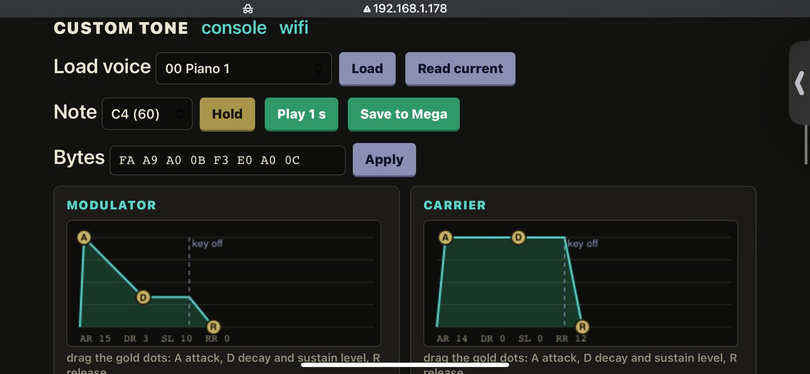
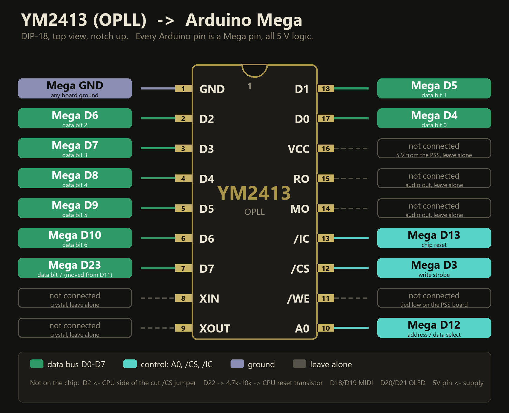

# PSS-270 Mega DX (WIP)

**Give a Yamaha PSS-270 a new brain.** An Arduino Mega + ESP8266 takes over the YM2413 FM chip and the keyboard: MIDI in/out, an arpeggiator, a key-driven menu, a **live FM tone editor with draggable envelopes**, and WiFi updates for both chips. The only change to the keyboard is one cut jumper and one reset wire.

> Made by JunkSmithWizard (JSW) together with Claude (Anthropic's AI).
> JSW: the hardware, the install, the ears, the "this sounds wrong" that found every bug. Claude: most of the code.

## Demo

 

The OLED sits behind the panel window (it even matches the cyan of the printed voice list), and the MIDI socket is in the side of the case. The whole thing is a stock PSS-270 on the outside.

## The install

  

Left to right: the whole board with the Mega taped to an acrylic sheet beside the keybed, the Mega with the 15-lead ribbon to the key matrix and the jumpers to the chip, and the MIDI socket in the case. It played three live jams in front of an audience.

## Screenshots

The tone editor runs on the ESP, so any phone or PC on your WiFi can use it. **Drag the gold dots** (A attack, D decay + sustain level, R release) and you hear it change while you drag. Every other FM control is a slider underneath. Same black / cream / green / gold look as the panel.

## What it does

| | |
|---|---|
| **Keys** | all 49 keys, learned once (like the UMR2 setup), 9-note polyphony |
| **MIDI** | in and out on a MIDI shield, channel 1-16, transpose, optional thru |
| **Voices** | the 100 PSS voices + the chip's 15 ROM instruments |
| **Arpeggiator** | up, down, up-down, random, as played, latch, 40-240 BPM, 1-4 octaves, **Euclid rhythms**, swing, note length, humanize |
| **Fake filter** | cutoff, resonance, a filter envelope per note, key tracking and velocity: made from the modulator level and feedback of the one user tone (the chip has no filter) |
| **Mega extras** | software on top of the chip: vibrato and tremolo with delay, pitch envelope, glide, a software volume ADSR (also on the ROM voices), detune and octave/interval layers, tone sweep (wobble), odd tunings (just, pythagorean, werckmeister, maqam rast and bayati, hand-tuned), chord memory with strum |
| **MIDI knobs** | mod wheel = vibrato, CC74 cutoff, CC71 resonance, CC73 attack, CC72 release, pedal, pitch bend |
| **Key menu** | hold the two highest keys for 5 s, then **C** = left, **D** = select, **E** = right. Everything is saved |
| **Tone editor** | all 8 YM2413 user-tone bytes live: sliders, draggable envelopes, voice loader, hold/play, save |
| **WiFi** | set up on the settings page (scan, add, delete), or join `PSS270-setup` if nothing connects. It scans first and goes straight to a known network in range |
| **Local mode** | one tap (web page or the keyboard menu, "WiFi mode") and the board makes its own WiFi `PSS270-setup`: no router needed, open `192.168.4.1` |
| **OLED address** | the board's web address is shown on the OLED, so you never have to hunt for it |
| **Settings pages** | Extras, Arp, Keyboard, WiFi mode, Networks, System, all with sliders. The same Extras/Arp/Keyboard sliders also sit under the FM controls on the tone editor |
| **Updates** | the ESP updates over WiFi, and the Mega updates **through the ESP** (no USB, no reset button) |
| **Boot** | `boot mega` and it parks itself a moment after the PSS powers on |
| **Standby** | when the PSS goes off the Mega lets go of the chip pins (no leak into the dead board), blanks the OLED after 20 s (`standby N`), and wakes by itself when the PSS returns |

## Quick start

You need: a **WiFi Mega** board (ATmega2560 + ESP8266), a MIDI shield, an SSD1306 OLED, a 5 V supply, and a PSS-270 you are willing to open.

1. **Wire it** (tables below). Cut the CPU-to-chip `/CS` jumper, and add the reset wire to the CPU's reset transistor.
2. **Power the Mega with 5 V into its 5 V pin.** ⚠ Not the barrel jack: it is unreliable on these clone boards.
3. **First flash over USB** (Arduino CLI, or the IDE with the same settings).
   - Mega: DIP **3+4**, `arduino-cli upload --fqbn arduino:avr:mega:cpu=atmega2560 firmware/mega/pss270_mega`
   - ESP: DIP **5+6+7**, power-cycle, `--fqbn esp8266:esp8266:generic:eesz=4M1M,ResetMethod=ck,baud=115200`. Optionally copy `secrets.example.h` to `secrets.h` first.
4. **Running mode:** DIP **1+2**, slide switch on **RXD0/TXD0**.
5. Open the address shown on the OLED (or `http://pss270.local`). Click **Park**, then **Learn keys** and press all 49 keys, lowest to highest. Type `boot mega` in the command box if you want the Mega synth at power-up.
6. **From now on, update over WiFi:** `firmware/mega/flash_wifi.sh` for the Mega, ArduinoOTA for the ESP.

### Wiring (everything 5 V)

| Mega | Goes to |
|---|---|
| D2 | CPU side of the cut `/CS` jumper (relay input) |
| D3 | YM2413 `/CS` (pin 12) |
| D4-D10, **D23** | YM2413 D0-D6 on D4-D10, **D7 on D23** (pins 17, 18, 2, 3, 4, 5, 6, 7) |
| D12 | YM2413 A0 (pin 10) |
| D13 | YM2413 `/IC` (pin 13) |
| D22 | 4.7k-10k to the base of the CPU reset transistor (holds the CPU in reset) |
| even pins 24-52 | the 15 keyboard ribbon leads, **any order** (learn mode sorts them out) |
| D18 / D19 | MIDI shield TX / RX |
| D20 / D21 | OLED SDA / SCL |
| A0 (optional) | PSS +5 V rail through 10k. Only needed to notice the PSS switching off while the Mega is parked (in stock mode it notices by itself) |

### WiFi Mega DIP switches

| Mode | ON |
|---|---|
| Running + WiFi flashing of the Mega | 1 2 |
| Flash the Mega over USB | 3 4 |
| Flash the ESP over USB (then power-cycle) | 5 6 7 |
| Read the ESP boot log over USB | 5 6 |

## Voices and limits

- **68 of the 100 PSS voices are one complete FM tone** and sound right. **32 are simplified**: the real PSS adds layers, pitch bends or retriggers with its CPU, and the Mega does not copy those yet.
- The 15 chip-ROM voices play but cannot be edited.
- The chip has **one custom-tone slot**, so every note shares the tone you are editing.
- The keys are not velocity sensitive. MIDI-in velocity sets the note volume.
- **The YM2413 needs relaxed write timing on long jumper wires**, so the Mega writes it slowly (about 0.5 ms per register). You will not hear it.

## Also in the box

- `tools/pitch_check.py`: plays every note, records the PSS on a sound card and prints each note's error in cents. Mine reads **0 of 49 notes off**. Run it after any reassembly: a flaky data wire shows up as random errors of exactly 128 pitch units.
- A console on the web page (and on TCP port 23) with commands for everything: `status`, `park`, `learn`, `boot mega`, `arp up`, `bpm 140`, `tw`, `tonesave`, `sense on`, `miditest`, `chantest` and more.
- `docs/TONES.md`: how to build your own `pss270_tones.h`.

## Important: where the voices come from

The Yamaha voice data is **not in this repo**. `pss270_tones.h` is a placeholder (every voice is the same plain tone) so the sketch builds. See `docs/TONES.md` to fill it in from your own keyboard.

## Status: work in progress 🚧

Working: keys, MIDI, voices, arpeggiator, menu, tone editor, WiFi setup, WiFi updates, boot mode, standby.

Not yet: the PSS **rhythms and auto-accompaniment** (the CPU used to do those), reading the **panel buttons**, and the layered/CPU-assisted voices.

Known issue: the ESP's web server has frozen a few times (it still answers ping, and only a power cycle fixes it). It is not the ESP running out of memory. `/sys` shows its health numbers and there is a low-memory restart, but the cause is still unknown.

## Legal

Yamaha, PortaSound, PSS-270 and YM2413 are trademarks of Yamaha Corporation. This project is independent and not affiliated with or endorsed by Yamaha. The code is MIT licensed (see `LICENSE`). The Yamaha voice data is not included.

Thanks to **fmillion** for the PSS-270 schematic and notes, **plgDavid** for the voice rips, and the **Highly Liquid UMR2** for the key-learn idea.

Thanks for enjoying, and God bless you! — JSW
